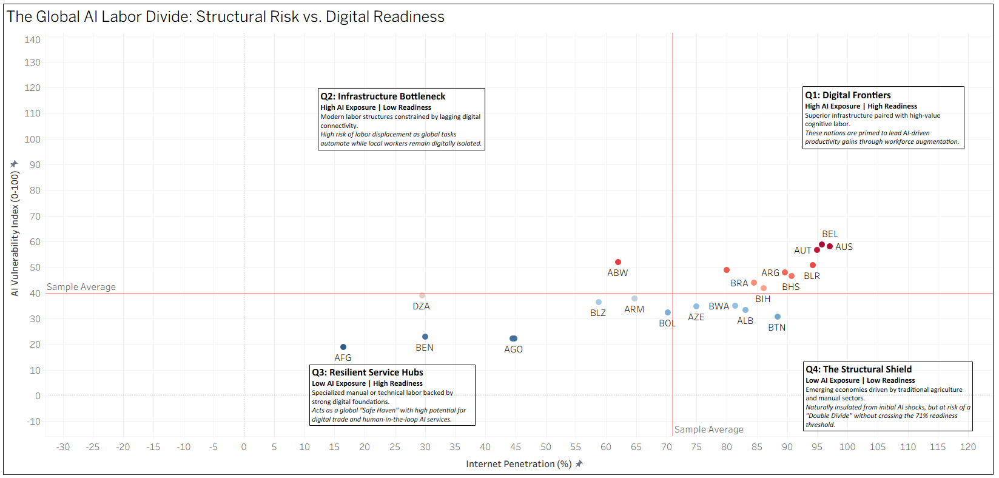

# Global AI Labor Vulnerability Index


## Executive Summary
This project evaluates the macroeconomic exposure of global labor markets to Generative AI. By engineering an original **AI Vulnerability Index** and cross-referencing it with **National Digital Readiness**, this analysis categorizes economies into four distinct strategic quadrants. 

The goal is to move beyond simple "job loss" predictions and understand whether a nation has the structural infrastructure to *capitalize* on AI augmentation, or if it faces a severe risk of labor displacement.

> **[View the Interactive Tableau Dashboard Here](https://public.tableau.com/views/GlobalAILaborDivideStructuralRiskvs_DigitalReadiness/Dashboard?:language=en-US&publish=yes&:sid=&:redirect=auth&:display_count=n&:origin=viz_share_link)**


---

## Data Architecture & Methodology

This project utilizes a custom Python ETL (Extract, Transform, Load) pipeline that interacts directly with live macroeconomic APIs. 

### 1. Data Extraction (Live API Integration)
* **Labor Structure:** Extracted occupational employment data via the **ILOSTAT API** (International Labour Organization). Filtered for total workforce distribution across the ISCO-08 major occupational groups.
* **Digital Infrastructure:** Extracted internet penetration rates (% of population) via the **World Bank API** (Indicator: `IT.NET.USER.ZS`).

### 2. Data Engineering & Transformation (Pandas)
* **Handling Sparse Global Data:** Developed a custom sorting and deduplication algorithm to extract the **"Latest Available Year"** for each country. This ensures inclusion of nations that do not report statistics annually, maximizing global representation.
* **The AI Vulnerability Index:** Calculated a weighted score (0-100) for each country. Weights were assigned to ISCO-08 categories based on their exposure to LLMs and automation (e.g., Clerical support workers = High Risk; Skilled agricultural workers = Low Risk). 
* **Aggregation:** Multiplied the national workforce share of each occupation by its respective AI risk weight, summing the results to create the final national index.

---

## Strategic Findings: The Four Quadrants

The resulting Tableau scatter plot categorizes the global economy into four distinct risk profiles, split by the sample averages for AI Exposure (40) and Internet Penetration (71%):

1. **Q1: Digital Frontiers (High Exposure | High Readiness)** 
   * *Profile:* Superior infrastructure paired with high-value cognitive labor (e.g., BEL, AUS, AUT). 
   * *Outlook:* Primed to lead AI-driven productivity gains through workforce augmentation.
2. **Q2: Infrastructure Bottleneck (High Exposure | Low Readiness)**
   * *Profile:* Modernizing labor structures constrained by lagging connectivity (e.g., ARG, BRB).
   * *Outlook:* High risk of labor displacement as global professional tasks automate, while local workers remain digitally isolated.
3. **Q3: Resilient Service Hubs (Low Exposure | High Readiness)**
   * *Profile:* Specialized or manual labor backed by strong digital foundations (e.g., ALB, BTN).
   * *Outlook:* Acts as a global "Safe Haven" with high potential for digital trade and human-in-the-loop AI services.
4. **Q4: The Structural Shield (Low Exposure | Low Readiness)**
   * *Profile:* Emerging economies driven by traditional agriculture/manual sectors (e.g., AFG, AGO).
   * *Outlook:* Naturally insulated from initial AI shocks, but at risk of a "Double Divide" without crossing the digital readiness threshold.

---

## How to Run the Pipeline

To replicate the data extraction and index calculation:

1. Clone this repository.
2. Ensure you have the required libraries installed:
   ```bash
   pip install pandas requests
